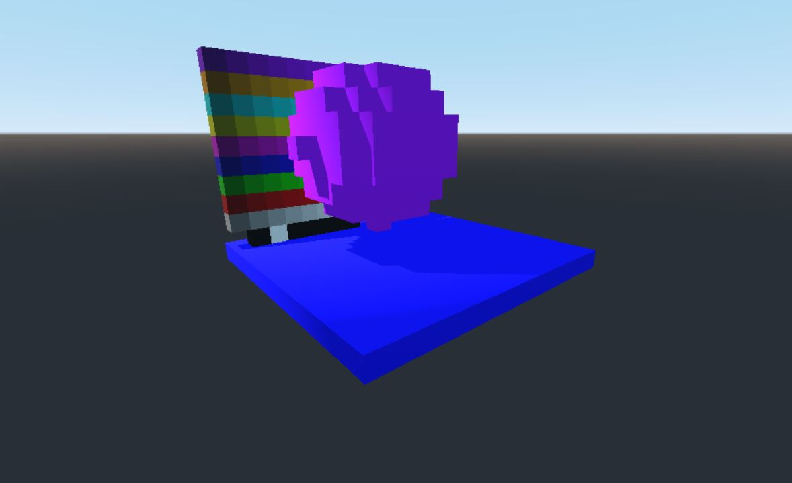

# voxelmeshercubesexample   

example for Godot Zylanns voxeltool voxelmeshercubes in C#   
you need a godot version with zylanns voxeltool and mono compiled.   

Version: 0.1 
Author: systemerror    

